# Health Agents Collective 🏥🤖

> **⚠️ WORK IN PROGRESS**: This project is under active development and may contain bugs or incomplete features. Use at your own risk.

A multi-agent healthcare AI system featuring triage nurse functionality with FHIR integration and orchestration capabilities. Built using Google's A2A (Agent-to-Agent) protocol and Pydantic AI framework.

## 📺 Watch the Demo

<a href="https://youtu.be/lq19K59VTV8" target="_blank">
  
</a>

## 🎯 Overview

Health Agents Collective implements a multi-agent assistant system specifically designed for healthcare applications. Each capability is implemented by an autonomous agent that exposes its skills through an HTTP interface using the A2A SDK. A lightweight orchestration agent receives user prompts, discovers available agents at runtime, and chains their tools to generate comprehensive healthcare responses.

## 🏗️ Architecture

### Agent Interaction Diagram

```mermaid
graph TB
    User[👤 User] -->|"Natural Language Query"| Orchestration[🏗️ Orchestration Agent<br/>Port: 10024]
    
    Orchestration -->|"Delegate Task"| Triage[🏥 Triage Agent<br/>Port: 10020]
    Orchestration -->|"Delegate Task"| FHIR[📊 FHIR Agent<br/>Port: 10028]
    
    Triage -->|"Assessment Results"| Orchestration
    FHIR -->|"Clinical Data"| Orchestration
    
    Orchestration -->|"Synthesized Response"| User
```



### Sequence Diagram


## 💬 Example Conversation

**User**: "I have a patient, John Doe, who has swollen lymph nodes in the neck and a mild fever."

**System**: 
1. **Orchestration Agent** receives the request.
2. Delegates to **FHIR Agent** to look up "John Doe" medical records.
3. Delegates to **Triage Agent** to assess "swollen lymph nodes" and "fever".
4. **Triage Agent** assesses as "Moderate" priority.
5. **Triage Agent** creates a FHIR Observation resource for the symptoms and writes it to the FHIR server.
6. **Orchestration Agent** combines findings:
   > "Patient John Doe is reporting swollen lymph nodes and fever. Triage assessment indicates **Moderate** priority. An Observation has been recorded in the FHIR server. Please schedule a follow-up appointment."

## 🚀 Quick Start

### Prerequisites

* Python **3.13+**
* **uv** package manager: `pip install uv`
* An **OpenAI-compatible** API key (e.g. `OPENROUTER_API_KEY`)
* **Logfire** account (optional, for observability)

### Installation

1. **Clone the repository**
   ```bash
   git clone https://github.com/micklynch/health-agents-collective.git
   cd health-agents-collective
   ```

2. **Install dependencies**
   ```bash
   uv sync
   source .venv/bin/activate
   ```

3. **Configure Environment**
   ```bash
   cp .env.example .env
   ```
   Edit `.env` with your API keys.

4. **Setup Logfire (Optional)**
   See the [Logfire Documentation](https://logfire.pydantic.dev/docs/) for details.
   ```bash
   logfire auth
   logfire projects use 'your-project-in-logfire'
   ```

5. **Run the System**
   ```bash
   python app.py
   ```

## 🏃‍♂️ Running Individual Agents

You can run agents independently for testing or distributed deployment:

```bash
# Triage Agent (Port 10020)
uvicorn src.agents.triage_agent.agent:app --port 10020 --reload

# FHIR Agent (Port 10028)
uvicorn src.agents.fhir_agent.agent:app --port 10028 --reload

# Orchestration Agent (Port 10024)
uvicorn src.agents.orchestration_agent.agent:app --port 10024 --reload
```

## 🔧 Configuration

### Agent Ports
* **Triage Agent**: 10020
* **FHIR Agent**: 10028
* **Orchestration Agent**: 10024

### FHIR Server
The system defaults to a public test server. Configure your own in `.env`:
```bash
FHIR_SERVER_URL=http://hapi.fhir.org/baseR4
```

## 🙏 Acknowledgments

Based on the **[Personal Assistant A2A](https://github.com/connorbell133/personal-asst-a2a)** project by **[Connor Bell](https://github.com/connorbell133)**.
