# Health Agents Collective 🏥🤖

> **⚠️ WORK IN PROGRESS**: This project is under active development and may contain bugs or incomplete features. Use at your own risk.

A multi-agent healthcare AI system featuring triage nurse functionality with FHIR integration and orchestration capabilities. Built using Google's A2A (Agent-to-Agent) protocol and Pydantic AI framework.

## 🙏 Acknowledgments

This project is based on the excellent work by **[Connor Bell](https://github.com/connorbell133)** and his **[Personal Assistant A2A](https://github.com/connorbell133/personal-asst-a2a)** project. The architecture, patterns, and many implementation details are adapted from Connor's work on multi-agent systems with A2A protocol integration. His project provided the foundation for understanding agent-to-agent communication patterns and the overall system design.

## 🎯 Overview

Health Agents Collective implements a privacy-first, multi-agent assistant system specifically designed for healthcare applications. Each capability is implemented by an autonomous agent that exposes its skills through an HTTP interface using the A2A SDK. A lightweight orchestration agent receives user prompts, discovers available agents at runtime, and chains their tools to generate comprehensive healthcare responses.

## ✨ Key Features

1. **🏥 Healthcare-Focused Architecture** - Every micro-agent (FHIR, Triage, Orchestration) is a standalone Starlette app that can run locally, remotely, or inside a container
2. **🔗 Dynamic Orchestration** - The central orchestration agent queries the agent registry, plans multi-tool workflows, and executes them automatically
3. **🤖 Bring-Your-Own-LLM** - Works with any OpenAI-compatible model (OpenAI, Anthropic, Google Vertex, OpenRouter, etc.)
4. **🔒 100% Local Execution** - No healthcare data leaves your machine except calls you intentionally make to the LLM provider
5. **⚡ Extensible** - Write a new agent in ≤ 100 LOC, register it, and it immediately becomes available to every other agent
6. **📋 FHIR R4 Compliant** - Full compliance with HL7 FHIR R4 standards for healthcare data interoperability

## 🏗️ Architecture

### Agent Interaction Diagram

```mermaid
graph TB
    User[👤 User] -->|"Natural Language Query"| Orchestration[🏗️ Orchestration Agent<br/>Port: 10024]

    Orchestration -->|"1. Discover Agents"| Registry[📋 Agent Registry]
    Registry -->|"Agent Capabilities"| Orchestration

    Orchestration -->|"2. Delegate Task"| Triage[🏥 Triage Agent<br/>Port: 10020]
    Orchestration -->|"3. Delegate Task"| FHIR[📊 FHIR Agent<br/>Port: 10028]

    Triage -->|"Patient Assessment"| TriageResponse[📋 Triage Results]
    FHIR -->|"Clinical Data"| FHIRResponse[📊 FHIR Data]

    TriageResponse -->|"Results"| Orchestration
    FHIRResponse -->|"Results"| Orchestration

    Orchestration -->|"4. Synthesize Response"| UserResponse[💬 Final Answer]
    UserResponse -->|"Response"| User
```



### Sequence Diagram


## 🚀 Quick Start

### Prerequisites

* Python **3.13+** (required by `pyproject.toml`)
* An **OpenAI-compatible** API key (e.g. `OPENROUTER_API_KEY`)
* **FHIR Server** access (configured via `FHIR_SERVER_URL`)
* **uv** package manager (recommended): `pip install uv`

### Installation

```bash
# 1. Clone the repository
git clone https://github.com/micklynch/health-agents-collective.git
cd health-agents-collective

# 2. Create virtual environment and install dependencies
uv sync
# OR with pip:
pip install -e .
# Activate the virtual environment
source .venv/bin/activate

# 3. Configure environment
cp .env.example .env
# Edit .env with your API keys and configuration

# 4. Run the application
python app.py
```

### Environment Configuration

Create a `.env` file with:

```bash
# LLM provider (choose one)
OPENROUTER_API_KEY=your-openrouter-api-key
# or OPENAI_API_KEY=your-openai-api-key
OPENROUTER_MODEL=openai/gpt-4o-mini

# FHIR Server Configuration
FHIR_SERVER_URL=http://your-fhir-server:8080/fhir
FHIR_HTTP_TIMEOUT=15

# Optional - Logfire for observability
LOGFIRE_TOKEN=your-logfire-token
LOGFIRE_PROJECT_NAME=healthcare-agents-collective
LOGFIRE_ENVIRONMENT=development
```

> The FHIR condition-search planner depends on an OpenAI-compatible API key (`OPENROUTER_API_KEY`, `OPENAI_API_KEY`, etc.). Without it the system falls back to a heuristic search plan, which may return fewer matches.

## 🏃‍♂️ Running the System

### Start All Agents
```bash
python app.py
```

> Ensure your shell session has sourced `.env` (for example `source .env`) before launching; otherwise the FHIR agent will skip the LLM planner and condition lookups may fail to find matches.

### Run Individual Agents
```bash
# Triage Agent only
uvicorn src.agents.triage_agent.agent:app --port 8080 --reload

# FHIR Agent only
uvicorn src.agents.fhir_agent.agent:app --port 8081 --reload
```

You can then go visit the individual agent at the Uvicorn address plus `/docs`.

### Interactive Mode
Once running, you'll see:
```
🤖 Health Agents Collective - Interactive Mode
Available agents:
  ✅ Triage Agent (port 10020) - Patient assessment and symptom evaluation
  ✅ FHIR Agent (port 10028) - Patient data retrieval and clinical records
  ✅ Orchestration Agent (port 10024) - Master coordinator for agent delegation

Type your questions or requests below. Enter '/quit' to exit.

💬 What would you like to do today?
```

## 🎯 Usage Examples

Try these commands in interactive mode:

```bash
# Patient triage assessment
"I have a patient with chest pain and shortness of breath"

# FHIR data retrieval
"Find patient data for John Smith, age 45"

# Agent capabilities
"What agents are available?"

# System information
"How does this system work?"
```

## 🏗️ Project Structure

```
health-agents-collective/
├── app.py                      # Main application launcher
├── src/
│   ├── agents/                 # Individual skill agents
│   │   ├── fhir_agent/        # FHIR R4 data operations
│   │   ├── triage_agent/      # Patient assessment and triage
│   │   ├── orchestration_agent/ # Master coordinator
│   │   └── common/            # Shared agent infrastructure
│   ├── mcp_handler/           # MCP server configurations
│   └── core/                  # Shared utilities and config
├── .env.example               # Environment configuration template
├── pyproject.toml             # Project dependencies
├── CLAUDE.md                  # Agent development guide
└── Agent2Agent_Protocol.md    # A2A protocol documentation
```

## 🧑‍💻 Development

### Adding a New Agent

Follow the pattern in `CLAUDE.md` to create new specialized agents:

1. Create agent directory: `src/agents/your_agent/`
2. Implement Pydantic-AI `Agent` with tools
3. Add MCP server configuration if needed
4. Register in `app.py`
5. Update orchestration agent system prompt

### Code Quality

```bash
# Install git hooks locally
uv tool install pre-commit
pre-commit install

# Run the hook suite on demand
pre-commit run --all-files

# Format and check code
uv run ruff format .
uv run ruff check .

# Run tests (when available)
uv run pytest
```

## 🔧 Configuration

### Agent Ports
- **Triage Agent**: 10020
- **FHIR Agent**: 10028
- **Orchestration Agent**: 10024

### FHIR Server
Configure your FHIR R4 server endpoint in `.env`:
```bash
FHIR_SERVER_URL=http://your-fhir-server:8080/fhir
```

## 🚨 Known Issues

⚠️ **Work in Progress** - Current limitations:

1. **TaskResponse Parsing**: There are ongoing issues with A2A response parsing that may cause delegation failures
2. **MCP Integration**: Some MCP servers may not be fully functional yet
3. **Error Handling**: Error messages could be more user-friendly
4. **Testing**: Limited test coverage - manual testing recommended
5. **Documentation**: Some agent capabilities are still being documented

## 🔒 Privacy & Security

- **No PHI in Logs**: The system is designed to avoid logging Protected Health Information
- **Local Processing**: Healthcare data stays local unless explicitly sent to LLM providers
- **Credential Security**: Sensitive credentials are excluded from version control via `.gitignore`
- **FHIR Compliance**: Follows HL7 FHIR R4 standards for data handling

## 🤝 Contributing

This is a research project, but contributions are welcome! Please:

1. Fork the repository
2. Create a feature branch
3. Make your changes
4. Test thoroughly (remember: work in progress!)
5. Submit a pull request

## 📄 License

This project is for research and educational purposes. Please ensure compliance with healthcare regulations (HIPAA, GDPR, etc.) in your jurisdiction.

## 🙏 Acknowledgments

- **[Connor Bell](https://github.com/connorbell133)** for the foundational Personal Assistant A2A project that inspired this work
- **Pydantic AI Team** for the excellent agent framework
- **Google A2A Protocol** for agent-to-agent communication standards
- **HL7 FHIR** for healthcare data interoperability standards
- **OpenRouter** for providing access to multiple LLM providers

---

> **⚠️ Disclaimer**: This software is provided "as is" for educational and research purposes. It is not intended for production medical use without proper validation, security review, and regulatory compliance. Always consult healthcare professionals for medical decisions.

**Status**: 🚧 Work in Progress - Expect bugs and breaking changes! 🚧
